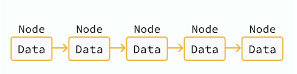

### **[단일 연결 리스트 - 노드의 정의]**

- **배열의 한계**
- 배열은 중간 삽입과 삭제의 시간복잡도가 $O(N)$으로 비효율적입니다.
- 삽입과 삭제를 자주 해야 하는 상황이라면 배열보다 다른 자료구조가 유리합니다.

- **연결 리스트(Linked List)의 등장**
- **탐색:** 느림 ($O(N)$)
- **삽입과 삭제:** 매우 빠름 (둘 모두 $O(1)$)
- 삽입과 삭제가 잦은 상황에서 주로 사용됩니다.

- **노드(Node)의 개념**
- 연결 리스트를 이해하기 위한 기본 단위로, '정보를 담는 하나의 창구'로 비유할 수 있습니다.
- 하나의 노드는 **데이터**와 다른 노드로 이동하는 경로(참조/포인터)를 가지고 있습니다.
- 연결 리스트는 이러한 여러 개의 노드가 모여서 형성되는 구조입니다.

